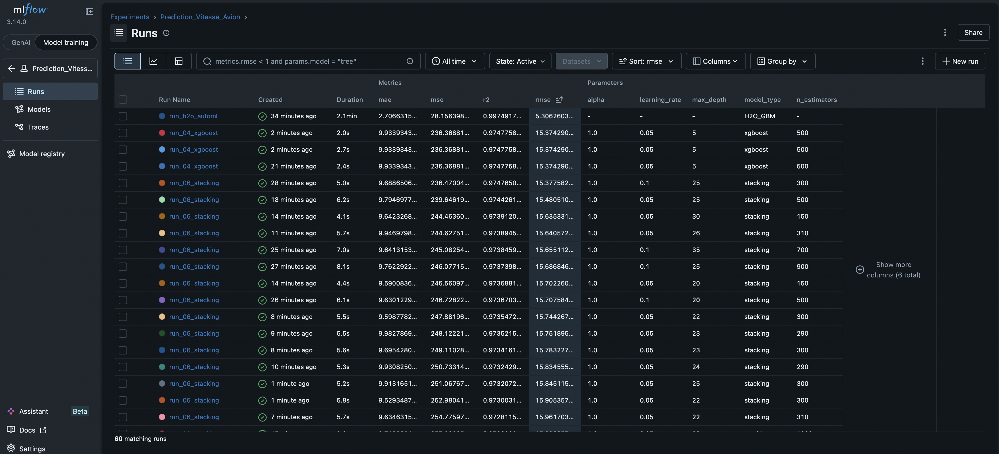

# ✈️ Aircraft Speed Prediction: End-to-End MLOps Pipeline

This repository contains the complete production-ready infrastructure for an MLOps pipeline dedicated to predicting the velocity of light and commercial aircraft based on their technical specifications. 

Following an extensive benchmarking phase (comparing Scikit-Learn, XGBoost, a custom Stacking Regressor, and Automated Machine Learning), the selected production champion is powered by **H2O AutoML** (Stacked Ensemble), delivering state-of-the-art performance with a **RMSE of ~5.30**.

---

## 🛠️ 1. Technical Architecture

The entire project is containerized using Docker Compose to ensure absolute reproducibility across environments. It is split into 4 decoupled microservices:

* **`mlflow`**: Tracking server that logs hyperparameters, metrics, and models using a local SQLite backend database.
* **`trainer`**: Isolated training environment designed to run ML experimentation scripts without disrupting production.
* **`api`**: Backend REST API built with **FastAPI** that serves the production model for low-latency inference.
* **`frontend`**: Interactive user interface developed with **Streamlit** for real-time model simulation.

---

## 🚀 2. Getting Started & Installation

Ensure you have [Docker](https://docs.docker.com/get-docker/) and Docker Compose installed on your machine.

1. **Clone the repository:**
   ```bash
   git clone [https://github.com/Wuradclan/mlops-aircraft-speed-prediction.git](https://github.com/Wuradclan/mlops-aircraft-speed-prediction.git)
   cd mlops-aircraft-speed-prediction
   ```

2. **Launch the entire infrastructure:**
   
```Bash
docker-compose up -d --build
```
(Note: If you modify the source code or need a clean state, purge the cache using docker-compose down -v before rebuilding).

🧠 3. **Running Experiments (Model Lifecycle):**

Model training is executed within the isolated trainer container. All training runs, parameters, and evaluation metrics are automatically synced to the MLflow server.
🏆 The Production Champion (AutoML)
This pipeline triggers H2O AutoML to automatically explore the hyperparameter space, perform feature scaling, and build a highly optimized Stacked Ensemble model.
```Bash
docker-compose exec trainer python src/train_h2o.py --model_type h2o
```

📊 Baseline Benchmarks (Scikit-Learn & XGBoost)
To thoroughly evaluate model performance and justify the deployment of H2O AutoML, you can train and track individual baseline models using the following CLI commands:
Tree-Based Ensembles:

```Bash
docker-compose exec trainer python src/train_h2o.py --model_type xgboost --n_estimators 500 --max_depth 5 --learning_rate 0.05
```
```Bash
docker-compose exec trainer python src/train_h2o.py --model_type random_forest --n_estimators 200 --max_depth 10
```
```Bash
docker-compose exec trainer python src/train_h2o.py --model_type extra_trees --n_estimators 200 --max_depth 10
```
Linear Models:

```Bash
docker-compose exec trainer python src/train_h2o.py --model_type linear
```
```Bash
docker-compose exec trainer python src/train_h2o.py --model_type ridge --alpha 10.0
```
```Bash
docker-compose exec trainer python src/train_h2o.py --model_type lasso --alpha 1.0
```
Distance-Based & Neural Networks: (These models automatically leverage the StandardScaler integrated into the preprocessing pipeline).
```Bash
docker-compose exec trainer python src/train_h2o.py --model_type knn
```
```Bash
docker-compose exec trainer python src/train_h2o.py --model_type svr
```
```Bash
docker-compose exec trainer python src/train_h2o.py --model_type mlp
```
Advanced Manual Ensembling (Pruned Stacking):
```Bash
docker-compose exec trainer python src/train_h2o.py --model_type stacking --n_estimators 200 --max_depth 5
```
📈 4. **Experiment Tracking & Comparison (MLflow) :**

All training runs are logged in real-time. You can analyze training histories, compare key evaluation metrics (RMSE, R2, MAE), and explore hyperparameter correlations.
Access the UI dashboard: http://localhost:5050
Select the Prediction_Vitesse_Avion experiment.
Below is an overview of the MLflow tracking registry showing the automated H2O champion outperforming classical baselines:


🔌 5. **Production Inference API (FastAPI).**

The winning model artifact is served via a high-performance REST API packaged with automated Swagger documentation.
Interactive Swagger Documentation: http://localhost:8000/docs
Prediction Endpoint: POST /predict
Dynamic Hot-Reloading: The /reload-model endpoint allows the API to fetch and load the latest champion model from the MLflow registry dynamically without requiring a server reboot.

🖥️ 6. **Interactive User Interface (Streamlit).**

A web interface was developed to bridge the gap between technical metrics and end-user business logic, permitting users to simulate technical aircraft characteristics and witness live predictions.
Access the web app: http://localhost:8501
Tweak technical specifications (such as Engine Type, Horsepower, Gross Weight, and Fuel Capacity) using the sidebar forms.
The UI queries the FastAPI backend asynchronously and displays both the computed speed and the raw JSON API response.


🧹 7. **Teardown & Clean Up.**

To gracefully stop and remove all active microservices while preserving the MLflow experiment history (persisted through Docker volumes):
Bash
docker-compose down
