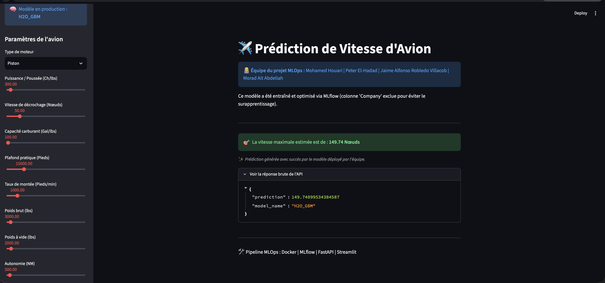

Markdown
# ✈️ Projet MLOps : Prédiction de Vitesse d'Avion

**👨‍💻 Équipe du projet :** Mohamed Houari | Peter El-Hadad | Jaime Alfonso Robledo Villacob | Morad Ait Abdellah

Ce dépôt contient l'infrastructure complète d'un pipeline MLOps dédié à la prédiction de la vitesse des avions de tourisme et commerciaux en fonction de leurs caractéristiques techniques. 

À l'issue de notre phase d'expérimentation et de benchmark (Scikit-Learn vs XGBoost vs Stacking vs AutoML), le modèle de production sélectionné est propulsé par **H2O AutoML** (Stacked Ensemble), offrant des performances de pointe avec un **RMSE de ~5.30**.

---

## 🛠️ 1. Architecture Technique

Le projet est entièrement conteneurisé via Docker Compose pour garantir la reproductibilité. Il se compose de 4 services principaux :

* **`mlflow`** : Serveur de tracking pour consigner les hyperparamètres, les métriques et les modèles (Base SQLite locale).
* **`trainer`** : Environnement d'entraînement isolé permettant d'exécuter les scripts de Machine Learning sans impacter la production.
* **`api`** : Backend FastAPI servant le modèle de production (Inférence).
* **`frontend`** : Interface utilisateur interactive développée avec Streamlit.

---

## 🚀 2. Installation et Démarrage

Assurez-vous d'avoir [Docker](https://docs.docker.com/get-docker/) et Docker Compose installés sur votre machine.

1. **Cloner le dépôt :**
   ```bash
   git clone <votre_lien_github>
   cd <nom_du_dossier>


Lancer l'infrastructure complète :
Bash
docker-compose up -d --build


(En cas de modification du code source ou de problème de cache, forcez le nettoyage avec docker-compose down -v avant de relancer).
🧠 3. Lancer les Expérimentations (Training)
L'entraînement des modèles s'effectue via le conteneur trainer. Tous les résultats sont automatiquement envoyés vers le serveur MLflow.
🏆 Le Modèle Champion (Production)
Ce modèle utilise H2O AutoML pour générer un Stacked Ensemble optimisé de manière autonome.


```bash
docker-compose exec trainer python src/train_h2o.py --model_type h2o
```

📊 Benchmark des Modèles de Base (Scikit-Learn)
Pour comparer les performances et justifier le choix du modèle H2O, vous pouvez exécuter ces modèles individuellement :
Modèles à base d'arbres :


```bash
docker-compose exec trainer python src/train_h2o.py --model_type xgboost --n_estimators 500 --max_depth 5 --learning_rate 0.05
docker-compose exec trainer python src/train_h2o.py --model_type random_forest --n_estimators 200 --max_depth 10
docker-compose exec trainer python src/train_h2o.py --model_type extra_trees --n_estimators 200 --max_depth 10
```

Modèles linéaires :


```bash
docker-compose exec trainer python src/train_h2o.py --model_type linear
docker-compose exec trainer python src/train_h2o.py --model_type ridge --alpha 10.0
docker-compose exec trainer python src/train_h2o.py --model_type lasso --alpha 1.0
```

Modèles basés sur la distance & Réseaux de Neurones :
(Ces modèles nécessitent le StandardScaler configuré dans le pipeline de preprocessing).


```bash
docker-compose exec trainer python src/train_h2o.py --model_type knn
docker-compose exec trainer python src/train_h2o.py --model_type svr
docker-compose exec trainer python src/train_h2o.py --model_type mlp
```

Architecture Avancée (Ensemble manuel) :


```bash
docker-compose exec trainer python src/train_h2o.py --model_type stacking --n_estimators 200 --max_depth 5
```

📈 4. Suivi et Comparaison des Modèles (MLflow)
Le suivi des expérimentations est disponible via l'interface web MLflow.
Accédez à : http://localhost:5050
Sélectionnez l'expérience Prediction_Vitesse_Avion.
Vous pouvez visualiser le registre des runs, comparer les métriques (RMSE, R2, MAE) et analyser l'impact des hyperparamètres via les graphiques en coordonnées parallèles.
Voici un aperçu de notre registre d'expérimentation affichant le modèle champion H2O AutoML surclassant les benchmarks classiques :


🔌 5. Inférence via l'API (FastAPI)
Le modèle gagnant est servi par une API robuste documentée automatiquement avec Swagger.
Documentation interactive : http://localhost:8000/docs
Endpoint de prédiction : POST /predict
La route /reload-model permet à l'API de charger dynamiquement le meilleur modèle depuis le registre MLflow sans nécessiter le redémarrage du serveur.


🖥️ 6. Interface Utilisateur (Streamlit)
Une interface web a été développée pour permettre aux utilisateurs de simuler les caractéristiques d'un avion et d'obtenir une prédiction instantanée.
Accédez à l'application web : http://localhost:8501
En cas de nouvel entraînement, utilisez le bouton "Recharger le modèle" pour synchroniser l'interface avec la dernière version en production.
Ajustez les paramètres techniques (Poids, Puissance, Type de moteur) à l'aide des formulaires pour observer les prédictions.



🧹 7. Arrêt de l'infrastructure
Pour éteindre proprement tous les services tout en conservant l'historique MLflow (grâce au volume partagé) :


```bash
docker-compose down
```
